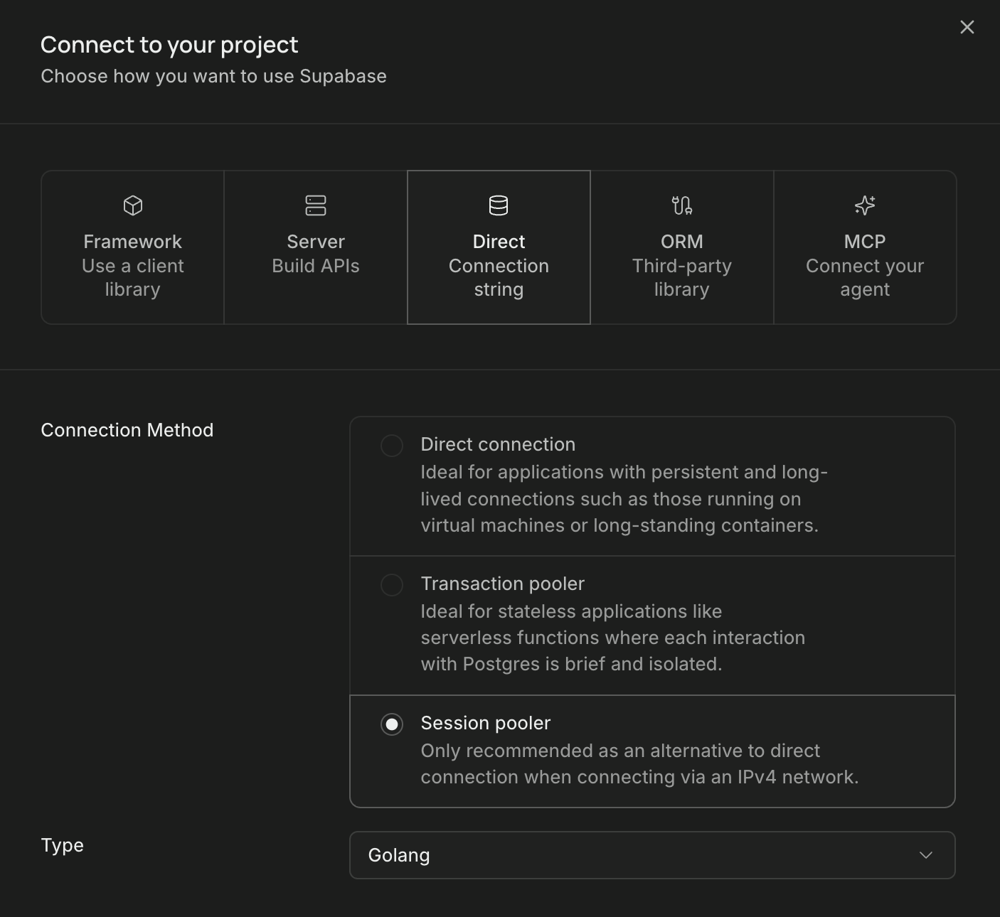

# Deployment

This profile keeps Aether as one Go service on Render, PostgreSQL on Supabase,
and immutable originals in the existing Google Drive vault. Cloudflare serves
the Vite build and proxies only `/api/*` and `/auth/*`, so browsers retain the
same-origin API, cookie, CSRF, upload, and download contracts.

No database rows or Drive objects are copied by this deployment.

## 1. Create and configure the Google Cloud project

Open the [Google Cloud console](https://console.cloud.google.com/) and create a
project dedicated to Aether, or select an existing project that is used only
for this deployment. Record the project name so that every credential below is
created in the same project.

Enable the Google Drive API:

1. Open **APIs & Services → Library**.
2. Search for **Google Drive API**.
3. Select it and click **Enable**.

Configure the OAuth consent screen under **Google Auth Platform**:

1. Under **Branding**, set the app name, user-support email, and developer
   contact email.
2. Under **Audience**, select **External** for a deployment used by personal or
   family Google accounts. While the app is in Testing, add the vault owner and
   every person who must sign in as test users.
3. Under **Data Access**, include the `openid`, `email`, and `profile` scopes for
   Aether login and the following scope for Drive storage:

   ```text
   https://www.googleapis.com/auth/drive.file
   ```

An External app in Testing that requests the Drive scope receives refresh
tokens that normally expire after seven days. Before creating the long-lived
Drive credential, publish the app to Production and complete any consent-screen
requirements shown by Google. Keep access restricted inside Aether through its
member allowlist; publishing the consent screen does not grant access to the
Aether application.

## 2. Deploy the frontend on Cloudflare Workers

Authenticate Wrangler and inspect the account before configuring Google or
Render:

```bash
cd frontend
pnpm exec wrangler login
pnpm exec wrangler whoami
```

Deploy using:

```bash
pnpm run deploy
```

The permanent origin is
`https://aether-vault.<workers-subdomain>.workers.dev`. Use that exact origin
for every value below. Changing it later requires updating Render and both
Google OAuth registrations.

Register these exact authorized redirect URIs in Google Cloud:

```text
https://aether-vault.<workers-subdomain>.workers.dev/auth/google/callback
https://aether-vault.<workers-subdomain>.workers.dev/auth/gdrive/callback
```

The Drive callback is retained as configuration compatibility for the existing
vault-owner credential. Normal deployments reuse the existing refresh token;
the loopback helper in `docs/google-drive-storage.md` remains the way to mint a
replacement token.

## 3. Create the Google OAuth clients and Drive credential

Create two separate OAuth clients in the Google Cloud project. Keeping login
and Drive storage credentials separate limits the effect of rotating or
revoking either credential.

### Create the Aether login client

Open **Google Auth Platform → Clients**, click **Create client**, and select
**Web application**. Name the client `Aether Login` and add this exact
authorized redirect URI:

```text
https://aether-vault.<workers-subdomain>.workers.dev/auth/google/callback
```

No authorized JavaScript origin is required because the backend performs the
authorization-code exchange. Create the client, then copy its values into the
Render secret configuration as follows:

| Google value  | Render environment variable   |
| ------------- | ----------------------------- |
| Client ID     | `AETHER_GOOGLE_CLIENT_ID`     |
| Client secret | `AETHER_GOOGLE_CLIENT_SECRET` |

Set the corresponding redirect variable to the exact URI registered above:

```text
AETHER_GOOGLE_REDIRECT_URL=https://aether-vault.<workers-subdomain>.workers.dev/auth/google/callback
```

### Create the Google Drive client

Create another **Web application** OAuth client named `Aether Drive Storage`.
Add both of these exact authorized redirect URIs:

```text
https://aether-vault.<workers-subdomain>.workers.dev/auth/gdrive/callback
http://127.0.0.1:8090/auth/gdrive/callback
```

The HTTPS URI is the deployed configuration value. The loopback URI is used by
the local one-time helper that obtains or rotates the vault owner's refresh
token. Copy this client's values into Render as follows:

| Google value  | Render environment variable   |
| ------------- | ----------------------------- |
| Client ID     | `AETHER_GDRIVE_CLIENT_ID`     |
| Client secret | `AETHER_GDRIVE_CLIENT_SECRET` |

Set the deployed redirect variable to the HTTPS URI:

```text
AETHER_GDRIVE_REDIRECT_URL=https://aether-vault.<workers-subdomain>.workers.dev/auth/gdrive/callback
```

Store both client secrets only in a password manager and Render's secret
configuration. Do not commit them or place them in frontend environment
variables.

### Create the Drive folder and refresh token

Sign in to Google Drive as the account that will own the vault. Create a folder
such as `Aether Vault`, then copy the folder ID from its URL:

```text
https://drive.google.com/drive/folders/<FOLDER_ID>
```

Set `<FOLDER_ID>` as `AETHER_GDRIVE_FOLDER_ID` in Render. Share the folder with
the Google accounts that Aether members will use to view documents; do not make
the folder public.

Make the Drive client ID and secret available in your local shell without
committing them, then run the credential helper from the repository root:

```bash
cd backend
go run ./cmd/aether-gdrive-auth \
  -client-id "$AETHER_GDRIVE_CLIENT_ID" \
  -client-secret "$AETHER_GDRIVE_CLIENT_SECRET" \
  -redirect-url http://127.0.0.1:8090/auth/gdrive/callback
```

Open the authorization URL printed by the helper, sign in as the vault owner,
and approve the Drive permission. Copy only the value after the equals sign in
the resulting line into Render as `AETHER_GDRIVE_REFRESH_TOKEN`:

```text
AETHER_GDRIVE_REFRESH_TOKEN=1//...
```

The refresh token is bound to the Drive OAuth client that created it. The
`AETHER_GDRIVE_CLIENT_ID`, `AETHER_GDRIVE_CLIENT_SECRET`, and refresh token in
Render must therefore come from the same client. If Google does not return a
refresh token, revoke the app's existing access from the vault owner's Google
Account and run the helper again.

## 4. Verify and lock down Supabase

Use the Supabase SQL editor as a privileged project administrator. This query
shows whether Aether tables have RLS enabled and whether the Data API roles
hold table privileges:

```sql
SELECT
    c.relname AS table_name,
    c.relrowsecurity AS rls_enabled,
    has_table_privilege('anon', c.oid, 'SELECT,INSERT,UPDATE,DELETE')
        AS anon_has_dml,
    has_table_privilege('authenticated', c.oid, 'SELECT,INSERT,UPDATE,DELETE')
        AS authenticated_has_dml
FROM pg_class AS c
JOIN pg_namespace AS n ON n.oid = c.relnamespace
WHERE n.nspname = 'public'
  AND c.relkind = 'r'
  AND c.relname = ANY (ARRAY[
      'schema_migrations_tbl', 'members_tbl', 'documents_tbl', 'tags_tbl',
      'document_tags_tbl', 'audit_events_tbl', 'sessions_tbl',
      'auth_flows_tbl', 'upload_requests_tbl'
  ])
ORDER BY c.relname;
```

All `rls_enabled` values must be true and both privilege columns must be false.
Migration `0008_supabase_data_api_lockdown.sql` establishes that state without
creating browser policies. It preserves all rows. Aether must connect through
the Supabase session pooler on port `5432` as the privileged backend database
role; do not use an `anon` or `authenticated` JWT role.

Click the `Connect` button on the Supabase project and choose the "Connection String" option, and
copy the value from the `.env` section.



The Render connection string must include TLS, for example:

```text
postgresql://<backend-role>:<password>@<project>.pooler.supabase.com:5432/postgres?sslmode=require
```

Keep this URL only in Render. No Supabase password or privileged key belongs in
Vite or Wrangler configuration.

## 5. Create the Render service

Create a Blueprint from the repository's `render.yaml`. Supply every value
marked `sync: false` in the Render dashboard. In particular:

- `AETHER_DATABASE_URL`: the TLS session-pooler URL described above.
- `AETHER_PUBLIC_URL`: the permanent Worker origin.
- `AETHER_GATEWAY_SECRET`: at least 32 random bytes, stored without quotes.
- `AETHER_STORAGE_PROVIDER`: already fixed to `gdrive` by the Blueprint.
- All existing Drive client, folder, and refresh-token values.
- All existing Google OIDC client values and bootstrap administrator email.
- `AETHER_GDRIVE_REDIRECT_URL` and `AETHER_GOOGLE_REDIRECT_URL`: the exact
  Worker callback URLs from steps 2 and 3.

Generate the shared secret locally without printing or committing it anywhere
except the two platform secret prompts:

```bash
openssl rand -base64 48
```

Render starts Aether with normal embedded migrations. Its filesystem is not
used for vault storage. After deployment, verify the boundary:

```bash
curl -i https://<render-service>.onrender.com/api/v1/health
curl -i https://<render-service>.onrender.com/api/v1/session
```

The health request must return `200`; the session request without the gateway
headers must return `404`.

## 6. Configure and deploy Cloudflare

Store both Worker bindings as secrets. `RENDER_ORIGIN` is the Render origin
without a trailing path, and `AETHER_GATEWAY_SECRET` must be byte-for-byte
identical to the Render value:

```bash
cd frontend
pnpm exec wrangler secret put RENDER_ORIGIN
pnpm exec wrangler secret put AETHER_GATEWAY_SECRET
pnpm run deploy
```

`pnpm run deploy` builds Vite first. Static navigation stays in Cloudflare
Assets; API and auth bodies are streamed through the Worker without buffering.
For local Worker validation, use `pnpm worker:dev` and provide development
secrets through Wrangler's local secret mechanism, never a `VITE_*` variable.

## 7. Smoke test and rollback

Through the Worker origin, verify Google login, session cookies, upload and
progress, range download, search, metadata edits, delete, restore, purge, and
member administration. Restart Render while a deletion is queued and confirm
the persisted job resumes.

If a smoke test fails, roll Render back to its previous deployment and use
Cloudflare Workers & Pages deployment history to roll the Worker back to its
previous version. Database rows and Drive objects require no rollback. The RLS
lockdown should remain in place; restoring browser Data API access requires a
separate reviewed migration with explicit policies and least-privilege grants.
