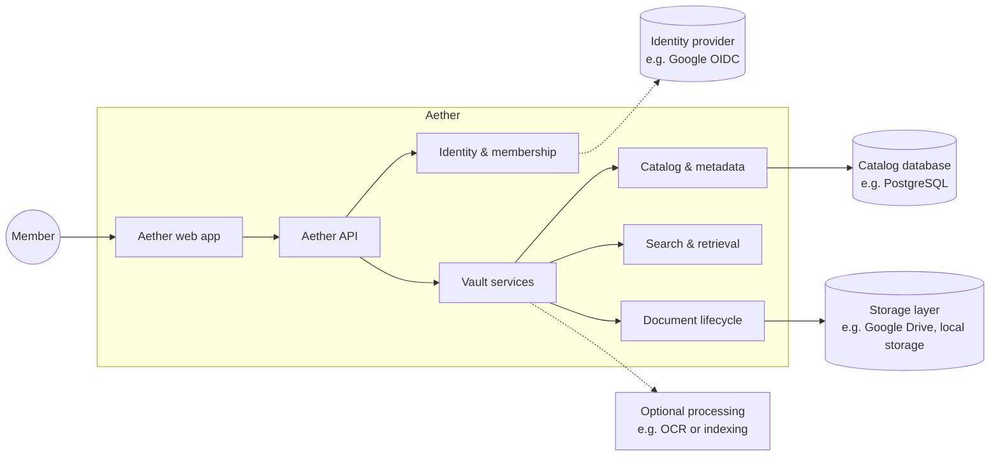
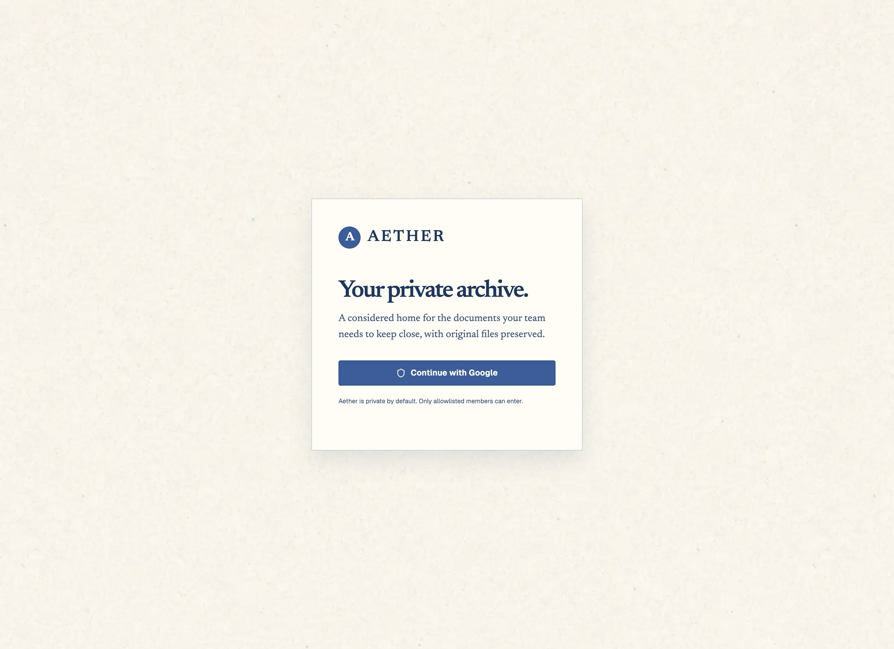
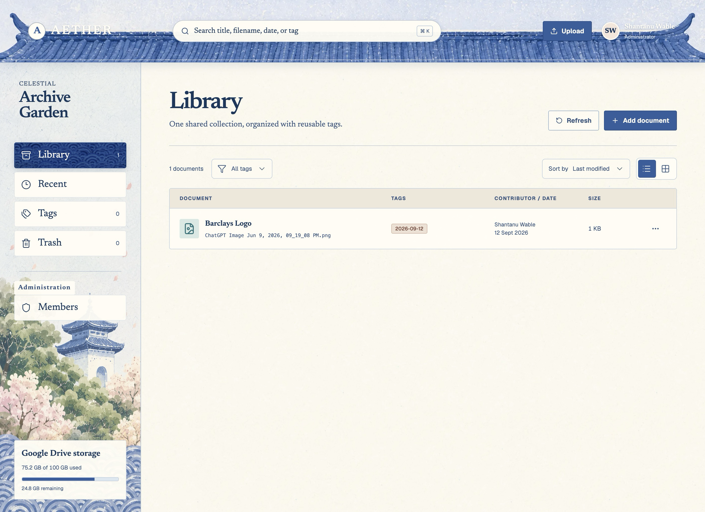
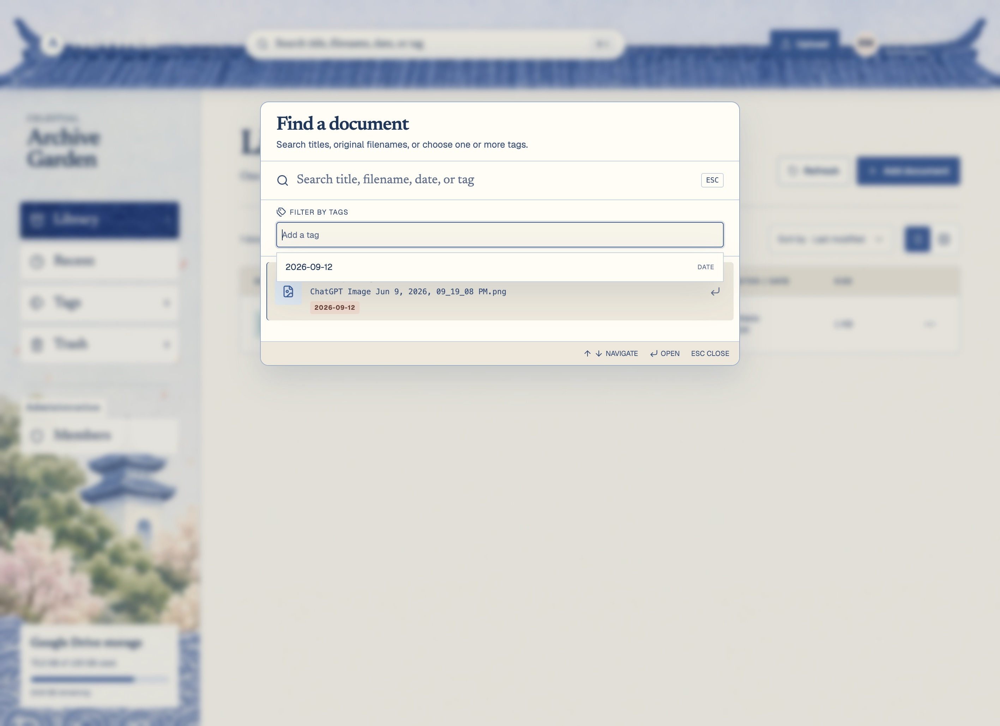

<div align="center">

# Aether

**A friendlier search for your documents in Google Drive.**

`[ae-ther]` · Old Greek · _the clear upper air that the gods breathe_

</div>

> Aether is a boomer-friendly search layer built on top of Google Drive as the storage.
> It is trying to solve a very personal problem that I had: helping my parents store and retrieve
> documents with (almost) natural language queries.

## Why does this project exist?

As mentioned above, Aether is built to tackle a very specific problem.
My parents would simply scan a bunch of documents but wouldn't name them intuitively / tag them
specifically. When they would want to find the document using memory, they'd just ask me and I would be
sitting there, scratching my head trying to rememeber what the name of the documemnt was (e.g. a
"prescription" from Doctor "X" which prescribes "A, B and C" medicines, which I had renamed
as `Adobe-Scan-10-04-2026.pdf` 😭).

I tried to solve this manually by renaming the files to be able to search them later, but that approach
fell apart, partly because of laziness, and partly because a file needed to have a reasonable name. I
couldn't just add all the words I associate the file with.
I also didn't want to pay for hosting and storage. Google Drive was more than enough. Thus, I built
this as a simple, self-hostable tool which works well at the family-scale.

## What you can do

- **Sign in privately** with Google OpenID Connect and an administrator-managed
  allowlist. Members and administrators have separate capabilities.
- **Build a shared library** by uploading original PDF, JPEG, PNG, and WebP
  files up to 50 MiB. Uploads are streamed, type-checked, checksummed, and kept
  byte-for-byte intact.
- **Organize without folder sprawl** using reusable, case-insensitive tags and
  automatically maintained document-date tags.
- **Find the source again** with ranked fuzzy search across titles and
  filenames, exact tag filters, and visible match evidence.
- **Work from the document itself** with previews, downloads, editable metadata,
  optimistic concurrency, and contributor information.
- **Recover safely** through a Trash workflow, asynchronous storage deletion,
  administrator restore, and retention-aware permanent purge.
- **Keep storage replaceable** through a provider-neutral object-store boundary:
  use Google Drive, local storage, or another provider that fits the environment.

## Get Started

To self-host your version of Aether, read [DEPLOY.md](./DEPLOY.md).

## Architecture



Aether keeps its core workflows behind explicit interfaces, so the surrounding
identity provider, catalog database, storage layer, processing tools, and host
environment can be chosen independently.

| Layer                      | Responsibility                                                                        |
| -------------------------- | ------------------------------------------------------------------------------------- |
| [`frontend/`](./frontend/) | React, TypeScript, Vite, and the responsive archive workspace.                        |
| [`backend/`](./backend/)   | Go HTTP API, identity, catalog, vault services, maintenance, and migrations.          |
| Catalog database           | Document metadata, tags, membership, sessions, upload idempotency, and audit records. |
| Storage layer              | Immutable originals and versioned manifests through a provider-neutral interface.     |
| Identity provider          | Verified identity and allowlist-backed authorization.                                 |

## Screenshots





## Status

Aether is an actively developed pilot build. The core private-vault workflow is
implemented; later processing capabilities continue to evolve alongside the
repository's staged plans.

## Run locally

### Prerequisites

- Go
- Node.js and [pnpm](https://pnpm.io/)
- PostgreSQL

### Start the backend

```bash
git clone https://github.com/shxntanu/aether.git
cd aether
cp .env.example .env
```

Update `AETHER_DATABASE_URL` in `.env` if your local PostgreSQL connection is
different. The backend reads `AETHER_*` environment variables directly, so
export the values before starting it:

```bash
set -a
source .env
set +a
make backend-run
```

The API listens on `http://localhost:8080` by default and runs embedded
migrations on startup. Local object storage is enabled by default at
`./data/vault`.

### Start the frontend

In a second terminal:

```bash
cd aether/frontend
pnpm install
pnpm dev
```

Open the Vite URL printed in the terminal, usually
`http://localhost:5173`. The frontend proxies `/api` and `/auth` to the local
backend.

To exercise Google login and the authenticated vault, configure the Google OIDC
variables and bootstrap administrator email described in
[`docs/identity.md`](./docs/identity.md). For Google Drive-backed storage,
follow [`docs/google-drive-storage.md`](./docs/google-drive-storage.md) instead
of putting provider secrets in the frontend.

## Verify the project

The root [`Makefile`](./Makefile) contains the repository checks:

```bash
make backend-test
make backend-vet
make frontend-test
make frontend-lint
make frontend-build
```

For the complete suite, run:

```bash
make test
```

## Documentation

| Guide                                                            | Use it for                                                             |
| ---------------------------------------------------------------- | ---------------------------------------------------------------------- |
| [`docs/identity.md`](./docs/identity.md)                         | Google OIDC, sessions, allowlisting, and administrator bootstrap.      |
| [`docs/local-vault.md`](./docs/local-vault.md)                   | Local storage, document APIs, tags, search, and deletion lifecycle.    |
| [`docs/google-drive-storage.md`](./docs/google-drive-storage.md) | Google Drive folder setup, refresh tokens, and provider configuration. |
| [`PRODUCT.md`](./PRODUCT.md)                                     | Product purpose, principles, constraints, and staged capability plan.  |
| [`DESIGN.md`](./DESIGN.md)                                       | The Celestial Archive Garden visual system behind the interface.       |

## Design direction

Aether's interface is the **Celestial Archive Garden**: a painted archive with
mineral paper, indigo architectural lines, peach folios, and moss-led status
signals. Editorial typography gives the archive a human voice while a dense,
keyboard-friendly worktable keeps everyday retrieval practical.

The visual language is in service of the product contract: preserve the source,
make the next document easy to find, and communicate lifecycle state honestly.

## Security and data boundaries

- Google authentication identifies a person; it does not grant access unless
  the account is active in Aether's member allowlist.
- Session cookies are opaque and stored server-side as digests. Mutating
  requests require CSRF protection and origin checks.
- Uploads enforce supported media types and a 50 MiB size limit at the server
  boundary, then record a SHA-256 digest and idempotency key.
- Original document bytes are immutable. Metadata changes use optimistic
  concurrency and are recorded in the catalog.
- Google Drive folders remain private. Provider credentials, session tokens,
  and other secrets stay out of page content, URLs, logs, and audit records.

## License

MIT
